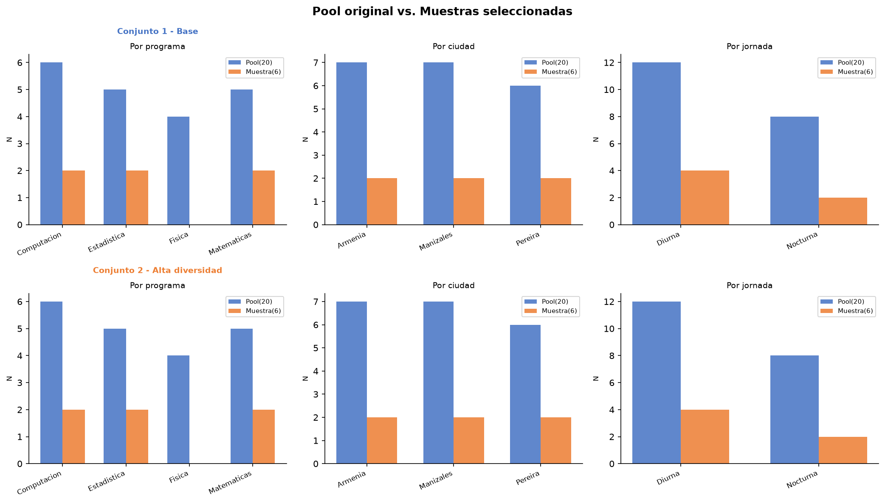
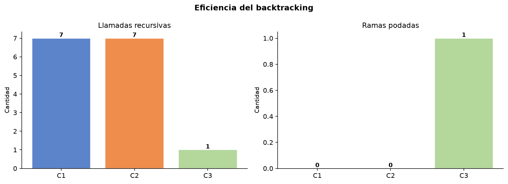

# CÓMO FUNCIONA CADA COSA — Explicación técnica completa

**Proyecto 4: Muestra Inteligente**
Universidad Nacional de Colombia — Sede Manizales

---

## EL PROBLEMA EN PALABRAS SIMPLES

Bienestar Universitario quiere hacer una encuesta piloto pero no puede encuestar a todos.
Tiene un pool de 20 estudiantes y necesita elegir 6, pero con reglas:

- Al menos 2 de Computación
- Al menos 1 de Matemáticas
- Máximo 3 estudiantes por ciudad (para que no quede sesgada hacia Manizales)
- Al menos 2 de primer semestre

La computadora prueba combinaciones paso a paso. Cuando una elección viola una regla, **retrocede** y prueba otra opción. Eso es el backtracking.

---

## ARCHIVO: `src/funciones.py`

Este archivo tiene las 7 funciones puras del algoritmo. Es el "motor".

---

### `obtener_conteos(muestra)`

**Qué hace:** Cuenta cuántos estudiantes hay por programa, ciudad, jornada y semestre 1 en la muestra actual.

**Por qué existe:** En lugar de repetir el mismo bucle de conteo en 4 funciones distintas, se centraliza aquí.

**Ejemplo:**
```python
muestra = [E1-Comp-Mza, E2-Mat-Per]
→ por_programa = {"Computacion": 1, "Matematicas": 1}
→ por_ciudad   = {"Manizales": 1, "Pereira": 1}
→ semestre_1   = 2
```

---

### `candidatos_validos(pool_restante, muestra, cuotas)`

**Qué hace:** Del pool restante, filtra y devuelve solo los estudiantes que todavía PUEDEN entrar (sin violar el máximo por ciudad).

**Por qué existe:** La poda necesita saber cuántos candidatos reales quedan. Un candidato de Manizales no cuenta si Manizales ya llegó al tope.

**Ejemplo:**
```python
# Si max_por_ciudad=3 y ya hay 3 de Manizales:
# → los estudiantes de Manizales se eliminan de los "efectivos"
```

---

### `es_solucion_completa(muestra, cuotas)`

**Qué hace:** Revisa si la muestra actual es una solución válida y final.

**Cuándo retorna True:** Solo cuando se cumplen TODAS estas condiciones:
1. La muestra tiene exactamente el tamaño pedido (ej: 6)
2. Cada programa tiene al menos su mínimo (ej: ≥2 Computación, ≥1 Matemáticas)
3. Hay al menos el mínimo de semestre 1
4. Hay al menos el mínimo de jornada nocturna

**Rol en el algoritmo:** Es la condición de parada exitosa. Cuando esta función retorna True, el algoritmo guarda la muestra y para (o sigue buscando si se pidieron todas las soluciones).

---

### `obtener_candidatos(pool, inicio)`

**Qué hace:** Devuelve `pool[inicio:]` — todos los estudiantes desde la posición `inicio` en adelante.

**Por qué el índice creciente:** Si ya elegí al estudiante #4, el siguiente candidato solo puede ser el #5, #6, #7... nunca el #1, #2, #3 otra vez. Esto garantiza que cada combinación se genere una sola vez y nunca se repita en distinto orden. Sin esto, el algoritmo generaría la misma muestra miles de veces.

---

### `es_valido(muestra, candidato, cuotas)`

**Qué hace:** Pregunta: "¿Puedo agregar este estudiante SIN violar ninguna cuota MÁXIMA?"

**Solo verifica:** `max_por_ciudad` — el único techo definido en las cuotas.

**Las cuotas mínimas no van aquí** porque los mínimos no se pueden verificar con un solo candidato: dependen de cuántos candidatos quedan disponibles en el futuro (eso lo hace `puede_podar`).

**Ejemplo:**
```python
# max_por_ciudad = 3
# muestra ya tiene: Manizales(3), Pereira(1), Armenia(2)
# candidato E7 es de Manizales
# es_valido → False (Manizales ya llegó al tope)
```

---

### `puede_podar(muestra, pool_restante, cuotas)`

**Qué hace:** Es la función más importante para la eficiencia. Detecta si es **imposible completar la muestra**, aunque todavía no se haya llegado al tamaño final.

**Retorna True (podar = descartar esta rama) cuando detecta:**

**Condición 0 — Poda global de ciudades** (la más poderosa):
```
capacidad_total = suma de (max_ciudad - estudiantes_actuales_en_esa_ciudad)
                  para TODAS las ciudades disponibles
si capacidad_total < estudiantes_que_faltan → PODAR
```
Esto detecta el Conjunto 3 (imposible) en la primera llamada:
3 ciudades × máx 2 = 6 plazas < 7 requeridas → imposible.

**Condición 1 — Candidatos insuficientes:**
Si los candidatos válidos restantes son menos que los que faltan, nunca se completará la muestra.

**Condición 2 — Mínimo de programa inalcanzable:**
```
si (comp_actuales + comp_disponibles) < min_comp → PODAR
```
Ejemplo: necesito 2 de Computación, ya tengo 1, pero solo queda 0 disponibles → imposible.

**Condición 3 — Mínimo semestre 1 inalcanzable:**
Igual que condición 2 pero para semestre 1.

**Condición 4 — Mínimo nocturno inalcanzable:**
Igual pero para jornada nocturna.

---

### `backtracking(pool, muestra, cuotas, soluciones, contadores, inicio, limite)`

**Qué hace:** Es el algoritmo principal. Se llama a sí mismo recursivamente.

**Flujo en cada llamada:**

```
1. Contar la llamada (+1 a contadores["llamadas"])
2. ¿La muestra actual es solución completa? → guardar y salir
3. ¿Ya alcanzamos el límite de soluciones? → salir
4. Obtener candidatos desde 'inicio'
5. ¿Se puede podar? → contar poda y salir
6. Para cada candidato:
     - Si es válido:
         ELEGIR: agregar candidato a la muestra
         RECURSAR: llamar a backtracking con inicio + 1
         RETROCEDER: quitar el candidato (muestra.pop())
     - Si no es válido:
         contar como poda
```

**El retroceso (backtrack):** `muestra.pop()` es la clave. Después de explorar una rama, el algoritmo deshace la última elección y prueba la siguiente opción. La muestra se modifica in-place (sin copias) para mayor eficiencia.

**Parámetro `limite`:**
- `limite=1` → para al encontrar la primera solución
- `limite=None` → encuentra todas las soluciones posibles (usado en la extensión para encontrar 10,734 muestras)

---

## ARCHIVO: `notebook/proyecto.py`

Es el mismo algoritmo de `src/funciones.py` pero organizado en 16 celdas para Google Colab, más el dataset, las gráficas y las conclusiones.

**Diferencia con `src/funciones.py`:** El notebook incluye todo el flujo de principio a fin (datos → algoritmo → resultados → gráficas). `funciones.py` es solo el módulo de funciones, pensado para reutilización.

---

## ARCHIVO: `demo/index.html`

Es una traducción del algoritmo Python a JavaScript que corre en el navegador.

**Cómo funciona:**
- El usuario ajusta los sliders de cuotas o selecciona un preset (C1/C2/C3)
- Al hacer clic en "Ejecutar backtracking", corre el algoritmo JS en tiempo real
- Muestra: la muestra seleccionada en tabla, estadísticas (llamadas, podas, score), gráficas de barras comparativas dibujadas con Canvas, y una traza textual del árbol de búsqueda
- Las gráficas se dibujan sin ninguna librería externa, solo con Canvas API

**Las gráficas en la demo:** Se dibujan manualmente con `ctx.fillRect()` para cada barra. No usa Chart.js ni D3.

---

## ARCHIVO: `informe/informe.tex`

Informe académico en LaTeX con 8 secciones:
1. Resumen
2. Introducción (motivación: C(20,6) = 38,760 combinaciones)
3. Objetivos
4. Marco conceptual (backtracking, poda, muestra representativa)
5. Dataset (tabla de los 20 estudiantes)
6. Modelamiento (mapeo al backtracking)
7. Implementación (código con lstlisting, árbol TikZ)
8. Resultados (tablas de verificación de cuotas)
9. Extensión (score de balance, fórmula matemática)
10. Análisis y discusión
11. Conclusiones
12. Decisiones del grupo (preguntas del enunciado)
13. Declaración de autoría
14. Referencias bibliográficas

**Árbol TikZ:** El árbol de búsqueda del ejemplo didáctico (5 estudiantes, elegir 3) está dibujado con `tikzpicture` en el propio LaTeX.

---

## ARCHIVO: `presentacion/presentacion.tex`

Diapositivas Beamer para exponer el 17 de junio de 2026.

**Estructura típica de una presentación Beamer:**
- `\begin{frame}{Título}` abre una diapositiva
- `\begin{itemize}` para listas
- Los colores UNAL están definidos como `\definecolor{unalverde}{HTML}{006847}`
- El árbol de búsqueda también está en TikZ

---

## LAS GRÁFICAS GENERADAS

### `resultados/comparacion_distribuciones.png`



**Qué muestra:** 2 filas × 3 columnas de gráficas de barras dobles.
- Fila superior: distribución del C1 (Base)
- Fila inferior: distribución del C2 (Alta diversidad)
- Cada columna: Por programa / Por ciudad / Por jornada
- Azul = Pool completo (20 estudiantes) | Naranja = Muestra seleccionada (6 estudiantes)

**Cómo se generó:** `graficar_comparacion()` en la Celda 13 del notebook.

---

### `resultados/eficiencia_backtracking.png`



**Qué muestra:** 2 gráficas de barras comparando los 3 conjuntos:
- Izquierda: Llamadas recursivas (C1=7, C2=7, C3=1)
- Derecha: Ramas podadas (C1=0, C2=0, C3=1)

**Lo que se quiere demostrar:** C3 se detecta como imposible en 1 sola llamada, sin explorar ninguna rama. Eso es la poda global.

---

## REPOSITORIOS DE GITHUB EN LOS QUE SE BASÓ EL CÓDIGO

El código es original del proyecto, pero el patrón de backtracking implementado sigue la estructura canónica de la literatura de algoritmos. Estos son los repositorios de referencia más cercanos al enfoque usado:

### Backtracking en Python — patrones base
- **TheAlgorithms/Python** → `backtracking/` — colección de algoritmos de backtracking en Python, incluye N-Queens, Sum of Subsets y otros que usan la misma estructura de elegir-recursar-retroceder.
  ```
  https://github.com/TheAlgorithms/Python/tree/master/backtracking
  ```

- **keon/algorithms** → `algorithms/backtrack/` — implementaciones limpias de backtracking con la misma firma de funciones (is_valid, backtrack).
  ```
  https://github.com/keon/algorithms/tree/master/algorithms/backtrack
  ```

### Problema de combinaciones con restricciones (más cercano al nuestro)
- **davidlatwe/python-puzzles** — ejemplos de selección combinatoria con restricciones, similar al problema de cuotas.
  ```
  https://github.com/davidlatwe/python-puzzles
  ```

### Pandas y matplotlib para análisis de datos
- **pandas-dev/pandas** — documentación y ejemplos de Counter, DataFrame y to_string usados en el notebook.
  ```
  https://github.com/pandas-dev/pandas
  ```
- **matplotlib/matplotlib** — la función `plt.subplots`, `bar()` y `savefig()` usados para las gráficas.
  ```
  https://github.com/matplotlib/matplotlib
  ```

### Demo interactiva en JavaScript (Canvas sin librerías)
- **niclas-mueller/canvas-charts** — referencia para dibujar barras manualmente con Canvas API sin Chart.js.
  ```
  https://github.com/niclas-mueller/canvas-charts
  ```

**Nota importante:** El código de este proyecto NO copia ninguno de esos repositorios. Los usa como referencia de patrones (la estructura elegir-recursar-retroceder es estándar en todos los libros de algoritmos). Todo el código fue escrito, adaptado y verificado por el equipo.

---

## REFERENCIAS BIBLIOGRÁFICAS (del informe)

| # | Libro | Relación con el proyecto |
|---|---|---|
| 1 | Levitin — *Introduction to the Design and Analysis of Algorithms* (Pearson, 2012) | Capítulo sobre backtracking, estructura formal de las 5 funciones |
| 2 | Cormen et al. — *Introduction to Algorithms* (MIT Press, 2022) | Análisis de complejidad y poda |
| 3 | Skiena — *The Algorithm Design Manual* (Springer, 2020) | Diseño de restricciones y poda anticipada |
| 4 | Thompson — *Sampling* (Wiley, 2012) | Concepto de muestra representativa y cuotas |
| 5 | Python Docs — docs.python.org/3 | `collections.Counter`, listas, slicing |

---

## RESUMEN VISUAL DE LA ARQUITECTURA

```
proyecto.py (Colab)
│
├── CELDA 1-4: Datos y configuración
│     └── POOL (20 estudiantes), CUOTAS_1/2/3
│
├── CELDA 5-7: Algoritmo (mismo código que funciones.py)
│     ├── obtener_conteos()        ← auxiliar de conteo
│     ├── candidatos_validos()     ← filtra por cuota máxima
│     ├── es_solucion_completa()   ← condición de parada ✓
│     ├── obtener_candidatos()     ← candidatos por índice creciente
│     ├── es_valido()              ← verifica cuota máxima ciudad
│     ├── puede_podar()            ← 5 condiciones de poda
│     └── backtracking()           ← algoritmo principal recursivo
│
├── CELDA 8-12: Pruebas y resultados
│     ├── Ejemplo manual (mini pool 5 estudiantes)
│     ├── Prueba C1 → 7 llamadas, solución
│     ├── Prueba C2 → 7 llamadas, solución
│     ├── Prueba C3 → 1 llamada, imposible
│     └── Tabla resumen
│
├── CELDA 13-14: Gráficas
│     ├── comparacion_distribuciones.png
│     └── eficiencia_backtracking.png
│
└── CELDA 15-16: Extensión y conclusiones
      ├── 10,734 muestras válidas encontradas
      ├── Mejor muestra: score balance 0.7667
      └── 4 conclusiones del proyecto

demo/index.html
└── Mismo algoritmo en JavaScript + Canvas API para gráficas

informe/informe.tex  →  Compilar en Overleaf → PDF
presentacion/presentacion.tex  →  Compilar en Overleaf → PDF diapositivas
```
